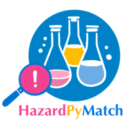

  

<h1 align="center">HazardPyMatch</h1>

A chemical inventory screening tool to detect and classify hazards, and text mine scientific protocols for use in wet labs. Accessible tool designed for step-by-step jupyterlab or google colab implementation. Written for scientists that do not necessarily have intermediate or expert programming skills*. 

  <a href="HazardPyMatch_ReadMe.pdf">📄 Link to the ReadMe (PDF)</a>

